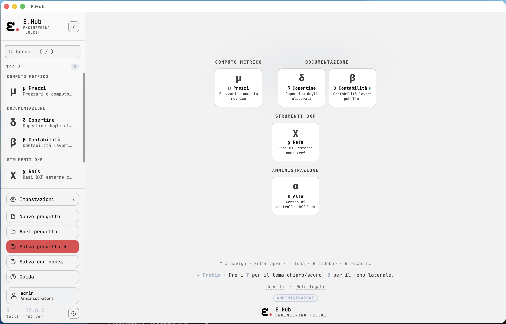
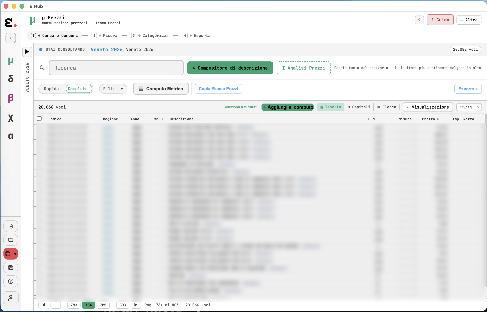
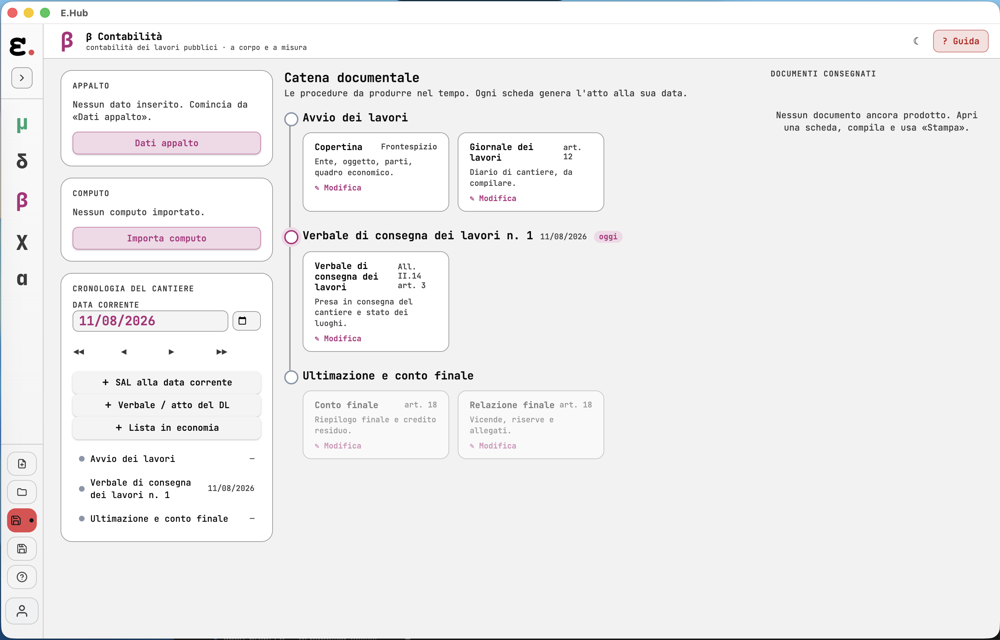
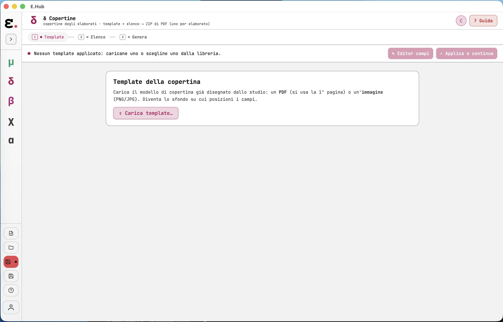
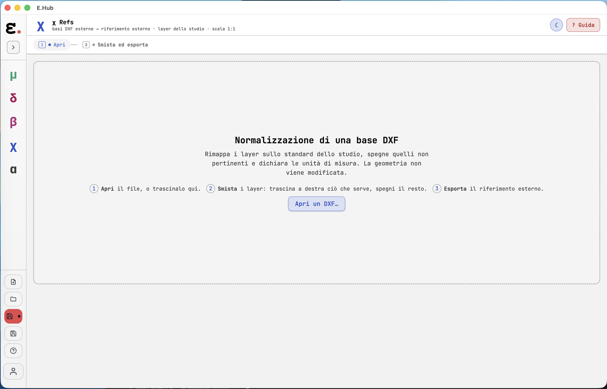
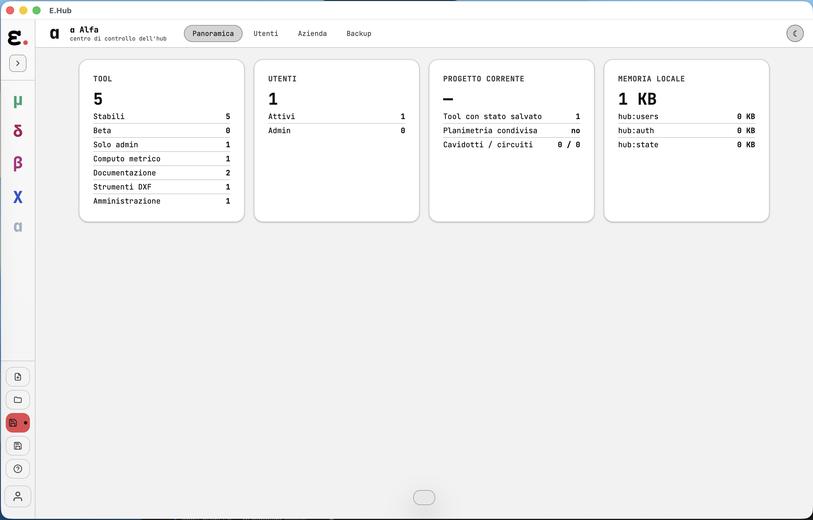

# 00 — Perché Open E.Hub

> Questa pagina è per chi sta decidendo se scaricare Open E.Hub, non per chi sta già
> sviluppando. Per l'uso quotidiano vedi [02 — Guida Utente](02-Guida-Utente.md); per buildare
> vedi il [README](../README.md#-prima-volta-non-sei-uno-sviluppatore-inizia-qui).

## Il problema

Gli studi tecnici italiani di impiantistica lavorano
ogni giorno con **computi metrici, prezzari regionali, contabilità di cantiere, cartigli ed
elaborati grafici** — e lo fanno quasi sempre con fogli Excel fatti a mano, software commerciali
chiusi e costosi, o un misto scomodo dei due. Ogni studio ha le sue convenzioni (come sono fatti
i cartigli, come sono organizzati i prezzari, come si chiamano gli elaborati), e nessun software
chiuso si adatta davvero a *quelle* convenzioni senza customizzazioni a pagamento.

## Perché open source

**Deve vincere l'idea, non la monetizzazione.** Open E.Hub nasce come costola gratuita e aperta
di un prodotto sviluppato per un caso reale (uno studio di progettazione), in continuo sviluppo. Il codice della versione base è pubblico,
la licenza è **MIT** — puoi usarlo, modificarlo, ridistribuirlo, anche a fini commerciali, senza
dover chiedere permesso a nessuno e senza dover pagare nessuno.

Il rovescio della medaglia, detto onestamente: **non è già rifinita per il tuo studio come lo è
una versione customizzata su misura.** È una base solida, con i motori di calcolo veri (non
demo), che uno studio — o il suo IT, o un freelance a cui lo studio si appoggia — porta
all'ultimo miglio con i propri dati. Vedi ["Cosa manca rispetto a una versione
customizzata"](#cosa-cè-e-cosa-non-cè) più sotto: lo diciamo chiaro, non lo scopriamo dopo.

## I 5 strumenti

Ogni strumento è un singolo file HTML autonomo, aperto dentro l'hub (o da solo in un browser).
Comunicano tra loro: il computo fatto in μ passa a β senza ridigitarlo.

### μ Prezzi

*Le voci sono sfocate di proposito: Open E.Hub non distribuisce prezzari di terzi, nemmeno
in una schermata. I prezzari li porti tu.*

Carichi i tuoi prezzari (Excel/XLSX — regionali, DEI, o il tuo listino interno) e cerchi le
voci per parola esatta — funziona da subito, su qualunque prezzario. Il motore supporta anche
una ricerca "in linguaggio naturale" che riconosce i sinonimi (cerchi "differenziale" e trova
anche "interruttore automatico magnetotermico differenziale"), ma quel livello parte **vuoto**:
è un vocabolario da costruire nel codice ([vedi più
sotto](#piattaforma-bianca-come-si-personalizza)), non qualcosa che si accende da solo. Componi il
computo metrico, confronti prezzi tra archivi diversi, vedi il dettaglio di ogni voce in un
pannello laterale, ed esporti il computo in un **Excel editabile** (formato generico, nessun
software di terzi richiesto) oltre che in PDF. È il cuore della suite: gli altri tool partono dal
suo computo. Se un prezzario lo consulti ogni giorno, puoi anche incorporarlo nell'app una volta
per tutte, invece di ricollegarlo a ogni sessione ([punto D](#piattaforma-bianca-come-si-personalizza)).

### β Contabilità

Contabilità di cantiere per **lavori pubblici**: dal computo di μ genera libretto delle misure,
registro di contabilità, stati di avanzamento (SAL), certificati di pagamento — lavori a misura
e a corpo. Scrive anche i verbali del Direttore dei Lavori (consegna, sospensione, ripresa).

### δ Copertine

Prendi il tuo cartiglio (un PDF o un'immagine) come sfondo, ci disponi sopra i campi (numero
tavola, oggetto, scala…), e da un elenco elaborati δ genera in un colpo solo uno ZIP con un PDF
per ogni elaborato — riconoscendo da sé i campi ricorrenti. Esporta anche in DXF.

### χ Refs

Un collaboratore ti manda una base DXF con i suoi nomi di layer, diversi dai tuoi. χ te la fa
diventare un riferimento esterno (xref) pulito: sposta i suoi layer sui tuoi, spegne quello che
non serve, dichiara le unità. Quello che facevi a mano in AutoCAD a ogni consegna.

### α Alfa

Il pannello di amministrazione dell'hub: utenti dello studio, logo/nome per le stampe,
statistiche d'uso, backup dei dati. Visibile solo a chi ha il ruolo di amministratore.

## Piattaforma bianca: come si personalizza

Open E.Hub arriva **vuoto di dati**, non vuoto di funzioni. La differenza è voluta. Ma non tutte
le personalizzazioni si fanno allo stesso modo — è importante saperlo prima, non scoprirlo dopo:

**A. Dall'app, ogni giorno — nessun codice, nessun rebuild.** Sono i normali *import* che fai
lavorando: carichi il tuo prezzario (μ Prezzi → import Excel), carichi il tuo cartiglio come
sfondo (δ Copertine → template), metti nome/logo dello studio (Impostazioni → Aspetto/Backup),
aggiungi un nuovo layer di destinazione in χ Refs quando lo standard non ne ha uno adatto
(bottone "Nuovo layer" — resta nel progetto, non serve toccare il codice).

**B. Si costruisce da solo usando l'app — nessun codice, ma non è un import.** L'albero
Categorie del computo metrico (μ) non lo importi: si arricchisce da sé man mano che categorizzi
le voci nei tuoi computi, senza un passaggio esplicito.

**C. Nel codice sorgente, poi si builda — lavoro da IT/sviluppatore (o un agente AI, vedi
[CLAUDE.md](../CLAUDE.md)).** Sono le PARTI dell'applicazione, non dati di un singolo progetto:
il thesaurus di sinonimi per la ricerca "in linguaggio naturale" di μ (`src/shared/compositore/`
— parte **vuoto**, va scritto lì; la ricerca a parola esatta funziona comunque sempre, senza
questo passaggio) e il *set di partenza* dei nomi/colori dello standard layer DXF di χ
(`src/shared/xref/standard.ts` — aggiungere UN layer si fa dall'app, punto A; cambiare i
default per TUTTI i nuovi progetti è qui).

**D. Dati innestati nel build — così non ricolleghi la cartella ogni volta.** L'import da UI del
punto A è comodo per un file una tantum, ma non lascia traccia: i prezzari caricati vivono in
memoria, e alla sessione dopo vanno ricollegati. Se un prezzario lo usi tutti i giorni conviene
*incorporarlo*: `npm run build:prezzari` normalizza il file grezzo, `npm run bundle:prezzari` lo
impacchetta, e da lì in poi compare nella barra laterale a ogni avvio — anche offline, e dentro
l'installer che distribuisci ai colleghi. È lavoro da terminale, quindi è esattamente il genere di
cosa da far fare a un assistente AI: la ricetta è già scritta per lui in [CLAUDE.md](../CLAUDE.md).
Detto chiaro: **nessuna AI vive dentro l'app**, l'assistente lavora sul progetto prima della build.
E il file grezzo lo procuri tu — la suite non distribuisce prezzari di nessuno; i formati che
riconosce da sé sono quelli per cui esiste già un parser, per gli altri va scritto.

Lo stesso meccanismo vale oltre i prezzari: è per questa via che entra anche il vocabolario del
punto C, che nella versione pubblica punta a un file di dati vuoto e in una customizzata al proprio.

Per A e B non c'è un passaggio di "attivazione" o un account da creare: apri l'app, carichi i
tuoi dati, e da subito lavori con le tue convenzioni. Per C e D serve editare o rigenerare qualcosa
e rilanciare `npm run build:web` (o l'installer) — un'operazione una tantum, non quotidiana.

**Com'è andata in un caso reale.** Nello studio di progettazione da cui questa suite deriva, la
personalizzazione ha toccato tutte e quattro le lettere:

- il **cartiglio dello studio** caricato una volta in δ, coi campi riconosciuti e riusati su ogni
  elaborato successivo (A);
- l'**albero delle categorie** del computo, che nessuno ha mai importato: si è formato da sé
  categorizzando le voci, commessa dopo commessa (B);
- il **vocabolario di ricerca** riempito con i termini che in quello studio si usano davvero, e lo
  **standard layer DXF** proprio, così le basi dei collaboratori atterrano sui layer giusti (C);
- i **prezzari** usati abitualmente, incorporati nell'app, e un **catalogo di voci ricorrenti** che
  ha trasformato la ricerca in una scelta fra decisioni già prese invece che in una caccia dentro
  decine di migliaia di righe (D).

Nessuno di questi è un interruttore da accendere: è lavoro, fatto una volta e poi capitalizzato. È
il motivo per cui la versione pubblica parte vuota — quel lavoro riguarda le convenzioni di *quello*
studio, e per il tuo le risposte sono altre.

**Quell'installazione, però, è più grande di quella che scarichi qui.** Monta più del doppio degli
strumenti: oltre a computo, contabilità, copertine e basi DXF ci sono l'elenco elaborati di
commessa, la relazione tecnica e il capitolato, il disegno dei circuiti e dei quadri elettrici, il
confronto fra il computo e le offerte ricevute, la legenda dei blocchi di tavola e un calcolo
illuminotecnico. Non sono programmi separati messi in fila: partono dallo stesso computo e si
passano i dati come fanno i cinque di qui. Quali restano fuori dalla v1, e perché, è la sezione
qui sotto.

**E non vive su un solo computer.** In quello studio la suite gira come applicazione web: ognuno
entra col proprio account, e quello che lo studio ha costruito — cartigli, catalogo delle voci,
vocabolario di ricerca — sta su un server invece che nella cartella di chi l'ha creato, così un
collega da un'altra postazione se lo ritrova già pronto, e a chi guida lo studio restano le
statistiche d'uso. È comodo, e ha un prezzo: vuole un server da mantenere, e con quello account da
gestire, backup da fare e responsabilità sui dati di tutti. Open E.Hub prende deliberatamente
l'altra strada — offline-first, nessun backend, nessun login — perché è l'unica versione che si
può dare a chiunque senza chiedergli in cambio di amministrare un servizio.

## Cosa c'è e cosa non c'è

Da quella versione a questa, la derivazione ha tolto due categorie di cose: **tool interi** non
ancora pronti per una release generalista, e **funzioni cloud/multi-postazione** che
richiederebbero un server, fuori scope per un progetto offline-first.

**Tutto ciò che è motore di calcolo — parsing prezzari, computo, contabilità, riconoscimento
layer, generazione cartigli — è lo stesso motore della versione customizzata, non una demo
semplificata.** Quello che manca è per lo più integrazione con formati/servizi di terze parti e
librerie condivise via cloud fra più postazioni dello stesso studio. Un confronto onesto,
strumento per strumento, per chi vuole sapere esattamente cosa aspettarsi:

- **χ Refs**: nessun compromesso sul motore, solo funzioni di
  import/incolla da un software di terzi in meno.
- **β Contabilità**: motore contabile identico, stesso tipo di riduzione di χ.
- **μ Prezzi**: motore di ricerca/computo identico, e la ricerca a parola esatta funziona da
  subito; il thesaurus di sinonimi per la ricerca "in linguaggio naturale" parte vuoto (va
  costruito nel codice, non impara da solo). Mancano inoltre l'integrazione nativa con un
  software di computo commerciale specifico e la libreria voci condivisa via cloud fra
  postazioni (resta l'uso in locale, singola postazione).
- **δ Copertine**: motore di generazione cartigli identico; manca la libreria cloud di modelli
  condivisi fra colleghi (resta il cartiglio per-progetto, salvato col progetto).
- **α Alfa**: resta la gestione utenti/azienda in locale; mancano le funzioni pensate per un
  servizio multi-azienda ospitato (login remoto, statistiche di utilizzo aggregate).

Non incluso in questa v1 (nessun tool a metà, semplicemente non ancora pronto per una release
generalista): un editor di elenco elaborati, un generatore di documenti d'appalto, un editor di
schemi elettrici/quadri, un calcolo per l'illuminazione stradale, un generatore di legenda DXF, e
un confronto fra computi e offerte —
tutti pezzi della stessa suite di progettazione impiantistica, non tool a sé stanti. Possono
arrivare in una versione futura.

## Il festival delle mini-app

Con gli assistenti AI, scrivere il piccolo strumento che ti serve non è più il problema: un
tecnico che sa spiegare bene cosa vuole oggi se lo fa costruire. Il problema è **dove farlo
vivere**. Quasi sempre finisce come uno script sul computer di chi l'ha scritto, senza
un'interfaccia presentabile, senza un posto da cui lanciarlo, e i colleghi non lo vedono nemmeno.

Open E.Hub è pensata anche per questo: un posto dove uno strumento nuovo è **una cartella sotto
`src/tools/` e poche righe di registro**, ed eredita gratis quello che di solito costa più del
motore — tema, guida, salvataggio del progetto, e il passaggio dati verso gli altri strumenti.
È terreno buono per un agente AI anche per un motivo poco romantico: le convenzioni della suite
non sono scritte solo in un documento, sono presidiate da test. Se un tool nuovo sbaglia i
pulsanti, il bus o le liste di registrazione, la verifica lo dice — e un agente il feedback
meccanico lo sa usare. Come si fa, in concreto, sta in
[04 — Aggiungere una nuova app](04-Aggiungere-una-Nuova-App.md) e in
[CONTRIBUTING](../CONTRIBUTING.md).

**Lo stato di oggi, senza giri di parole.** Si condivide con una **pull request**: lo strumento
entra nel repo e arriva agli altri quando la suite viene ricompilata e ridistribuita. Non esiste un
marketplace da cui scaricare tool, né un sistema che li carichi a caldo in un'installazione già
fatta — sono i due limiti veri, e sono in lavorazione; quando ci saranno lo si leggerà qui, non
prima. Nel frattempo vale la regola di sempre: licenza MIT, quindi un tool che scrivi tu resta tuo
e di chiunque lo voglia usare.

## Come iniziare

Se non sei uno sviluppatore, parti dalla sezione
[**"Prima volta? Non sei uno sviluppatore?"**](../README.md#-prima-volta-non-sei-uno-sviluppatore-inizia-qui)
nel README: build guidata passo-passo, incluso un messaggio pronto da dare a un assistente AI
che fa tutto al posto tuo. Se sei del mestiere, il README stesso e [Docs/03](03-Build-e-Release.md)
bastano.
